<div align="center">

<table>
  <tr>
    <td align="center"></td>
    <td align="center"></td>
    <td align="center"></td>
    <td align="center"></td>
  </tr>
</table>

# UITrends

**Jetpack Compose showcase — modern Android UI + on-device vision**

[](gradle/libs.versions.toml)
[](gradle/libs.versions.toml)
[](app/src/main/cpp/CMakeLists.txt)
[](app/build.gradle.kts)
[](LICENSE)

14 interactive UI demos, real navigation, and the **Pretext Engine** — CameraX + ML + native geometry for live paragraph reflow around people, faces, and objects.

[Demos](#demos) · [UI systems](#ui-systems) · [Pretext](#pretext-engine) · [pretext_geometry](#pretext_geometry) · [Reuse](#reuse-guide) · [Quick start](#quick-start) · [License](#license)

</div>

---

## Highlights

- **Blur & glass** — Haze scrims for sheets, dialogs, tooltips ([`ModalBackdrop.kt`](app/src/main/java/com/mfhapps/trendingui/ui/components/ModalBackdrop.kt))
- **Sticky attach** — progressive pin stack with haptics ([`PretextPlaygroundList.kt`](app/src/main/java/com/mfhapps/trendingui/screens/pretext/PretextPlaygroundList.kt))
- **Adaptive catalog** — list + detail on large screens, gradient-adaptive hero/chips
- **pretext_geometry** — custom C++ lib for contours, YUV conversion, optional NCNN YOLO
- **Settings** — theme, dynamic color, brand accent, blur toggle, catalog layout, alternate app icons

---

## Why open source?

MIT-licensed ([LICENSE](LICENSE)) so you can **read, copy, and fork** production-quality Compose patterns and the native vision stack.

Kotlin and every C++ file under `app/src/main/cpp/` are **Copyright (c) 2026 MFH Apps** with an SPDX header in each source file. Model weights and prebuilt libs (NCNN, etc.) have separate terms — see [THIRD_PARTY_NOTICES.md](THIRD_PARTY_NOTICES.md).

---

## Demos

| Demo | Category | What to look at |
| --- | --- | --- |
| Pretext Engine | Vision | Camera reflow, sticky playground, native contours |
| Virtual Chat | Layout | 500 shrink-wrapped bubbles, streaming |
| Bento Grid | Layout | Staggered cards, spring press |
| Glassmorphism | Surfaces | Frosted blur layers |
| Orbs & Mesh | Motion / sensors | Gyro parallax orbs |
| Kinetic Type | Motion | Scroll-driven typography |
| Neo-Brutalism | Surfaces | Hard shadows, bold borders |
| Neumorphism | Surfaces | Soft extruded controls |
| Zero UI | Interaction | Scroll/IME focus clearing |
| Spatial Depth | Adaptive | List–detail panes |
| Semantic Motion | Motion | Cause → effect animations |
| AI Copilot | AI | Streaming bottom sheet |
| Calm UI | Adaptive | Low-contrast supporting pane |
| Immersive Masonry | Layout | Scroll-driven masonry + color |

---

## UI systems

Reusable patterns beyond individual demo screens.

### Blur & modal backdrops

Global toggle: **Settings → Appearance → Blur sheet & dialog backdrops** (DataStore).

[`ModalBackdrop.kt`](app/src/main/java/com/mfhapps/trendingui/ui/components/ModalBackdrop.kt) coordinates Haze scrims for bottom sheets, alert dialogs, tooltips, and some collapsing headers. Respects device blur support and the user preference.

### Sticky attach stack

[`PretextPlaygroundList.kt`](app/src/main/java/com/mfhapps/trendingui/screens/pretext/PretextPlaygroundList.kt) — one `LazyColumn` where the text field, slider row, and benchmark button **pin progressively** as you scroll. Hard haptic on first attach; clean un-attach on reverse scroll. Scroll and IME hide clear field focus ([`DismissFocusOnScrollAndImeEffect.kt`](app/src/main/java/com/mfhapps/trendingui/ui/components/DismissFocusOnScrollAndImeEffect.kt)).

### Adaptive catalog

[`AdaptiveCatalogLayout.kt`](app/src/main/java/com/mfhapps/trendingui/navigation/AdaptiveCatalogLayout.kt) — two-pane list + detail on wide screens with shared transitions. Hero card and filter chips adapt foreground/background to the gradient behind them ([`CatalogColorMath.kt`](app/src/main/java/com/mfhapps/trendingui/ui/theme/CatalogColorMath.kt)). Catalog layout modes: list · bento · grid.

---

## Pretext engine

Live camera shapes become **polygon obstacles** that paragraph text flows around.

**Pipeline:** detect (ML) → contour (C++) → layout (`bandInterval` + Compose measure)

**Modes:** Person · Face · Object · Auto (face → person → object priority; multi-shape in camera overlay)

| Layer | File | Role |
| --- | --- | --- |
| Pipeline | `PretextCameraPipeline.kt` | CameraX analyzer, tracker, telemetry |
| Vision | `PretextVisionEngine.kt` | ML backends per mode |
| Contour bridge | `PretextContourExtractor.kt` | Kotlin → `PretextNativeGeometry` |
| View map | `PretextViewportMapper.kt` | Norm polygon → screen-pixel obstacle |
| Text layout | `TextMeasurementEngine.kt` | Line bands, slot carving, grapheme fit |

### ML backends

| Mode | Primary | Fallback | Contour fn |
| --- | --- | --- | --- |
| Person | TFLite selfie segmentation | Mask blob → rounded box | `extractPersonContour` |
| Face | MediaPipe face landmarker | TFLite BlazeFace box | `extractFaceContour` |
| Object | NCNN YOLO on YUV (native) | TFLite SSD (Auto / RGB) | `contourFromObjectBox` |
| Auto | All three, ranked by selector | — | Per winning mode |

### End-to-end pipeline

```mermaid
flowchart TB
    subgraph S0 ["① Camera pipeline — PretextCameraPipeline"]
        CX[CameraX ImageProxy] --> LOCK{processing lock free?}
        LOCK -->|no| DROP[drop frame · close proxy]
        LOCK -->|yes| MODECHK{mode changed?}
        MODECHK -->|yes| RESET[resetSmoothing · tracker.clear]
        MODECHK -->|no| STAGE
        RESET --> STAGE{stage + mode}
        STAGE -->|Auto + multi overlay| MULTI[detectAutoMulti max 3 shapes]
        STAGE -->|else| SINGLE[vision.detect]
    end

    subgraph S1 ["② Frame prep"]
        MULTI --> PREP
        SINGLE --> PREP
        PREP{input format}
        PREP -->|Person Face Auto| RGB[Kt: YUV→RGB888 · rotate to analysis WxH]
        PREP -->|Object only| YUV[Native: YUV420 direct buffers + row strides]
    end

    subgraph S2P ["③a Person detect"]
        RGB -->|Person / Auto| PSEG[TFLite selfie segmentation]
        PSEG --> PGATE{foreground gate · lensFacing}
        PGATE -->|fail| PNULL[no contour]
        PGATE -->|pass| PJNI[PretextContourExtractor.fromMask]
    end

    subgraph S2F ["③b Face detect"]
        RGB -->|Face / Auto| FMP[MediaPipe face landmarker → oval polyline]
        FMP -->|miss| FBF[TFLite BlazeFace → box]
        FMP -->|hit| FJNI1[fromFacePolyline]
        FBF --> FJNI2[fromFaceBox → ellipse ring]
    end

    subgraph S2O ["③c Object detect"]
        YUV --> YRGB[pretext_yuv_rgb: yuv420ToRgbRotate]
        YRGB --> NCNN1[pretext_ncnn_yolo: detectBest]
        RGB -->|Auto object| NCNN2[detectBestRgb] 
        NCNN2 -->|miss| SSD[TFLite SSD detector]
        NCNN1 --> OBOX[detection box LTRB + class + score]
        NCNN2 --> OBOX
        SSD --> OBOX
        OBOX --> OJNI[PretextContourExtractor.fromBox]
    end

    subgraph S2A ["③d Auto only"]
        RGB -->|Auto| ARUN[parallel run ③a + ③b + ③c]
        ARUN -.-> PSEG
        ARUN -.-> FMP
        ARUN -.-> NCNN2
    end

    subgraph S3P ["④ Person contour — extractPersonContour"]
        PJNI --> PDOWN[downsample mask ≤256px]
        PDOWN --> PBLUR[boxBlurMask 3×3]
        PBLUR --> PHYST[hysteresis binarize · largest blob trace]
        PHYST --> PSCALE[scale contour to image size]
        PSCALE --> PRDP[RDP simplify ≤96 verts]
        PRDP --> PCHAI[Chaikin smooth closed ring]
        PCHAI --> PPOSE{pose landmarks?}
        PPOSE -->|yes| PREF[refineWithPoseExtremities]
        PPOSE -->|no| PST
        PREF --> PST[smoothTemporal α≈0.44 · ch 0]
        PJNI -->|trace fail| PBLOB[Kt: mask blob tight/loose]
        PBLOB --> OJNI
    end

    subgraph S3F ["④ Face contour — extractFaceContour"]
        FJNI1 --> FRING[polyline → closed ring · RDP · Chaikin]
        FJNI2 --> FRING
        FRING --> FST[smoothTemporal α≈0.48 · ch 1]
    end

    subgraph S3O ["④ Object contour — contourFromObjectBox"]
        OJNI --> OARC[box → rounded-rect polygon arc corners]
        OARC --> OCHAI[Chaikin smooth]
        OCHAI --> OST[smoothTemporal α≈0.38 · ch 2]
    end

    subgraph S3S ["④ Temporal filter — all modes"]
        PST --> SMOOTH{jump / area spike?}
        FST --> SMOOTH
        OST --> SMOOTH
        SMOOTH -->|spike| HOLD[hold last good packet]
        SMOOTH -->|ok| BLEND[lerp verts + bounds · alignRingCyclic]
        HOLD --> PACK
        BLEND --> PACK[ContourPacket bounds + norm polygon 0…1]
    end

    subgraph S4 ["⑤ Kotlin bridge"]
        PACK --> JNI[pretext_geometry_jni · float packet]
        JNI --> NC[NativeContour.fromPacket]
        NC --> VC[VisionContour + source + label]
        VC --> CLAMP[area gates · clamp face/person size]
        CLAMP -->|reject| PNULL
    end

    subgraph S5 ["⑥ View mapping + tracking"]
        CLAMP -->|accept| ROUTE{Auto mode?}
        ROUTE -->|no| LAYOUT[PreviewLayoutCache · fill-center scale]
        ROUTE -->|yes| ARANK[PretextAutoSelector.rankAll · up to 3 reports]
        ARANK --> APICK[pickPrimary / pickMulti]
        APICK --> LAYOUT
        LAYOUT --> MAP[PretextViewportMapper · norm → view px]
        MAP --> MIRROR{front camera?}
        MIRROR -->|yes| FLIP[mirror X]
        MIRROR -->|no| POLY
        FLIP --> POLY[PolygonObstacle ≤96 pts]
        POLY --> TRK[PretextShapeTracker]
        TRK -->|hit| LIVE[onDetection · Live]
        TRK -->|soft miss| WEAK[onWeakMiss · Held]
        TRK -->|hard miss| LOST[onMiss · Lost]
    end

    subgraph S6 ["⑦ Text reflow — TextMeasurementEngine"]
        LIVE --> LINES[for each paragraph line band Y]
        WEAK --> LINES
        LINES --> FLAT[polygonToFlat px coords]
        FLAT --> BI[bandInterval C++: polygon ∩ band → minX maxX]
        BI --> BLOCK[blocked Interval on line]
        BLOCK --> CARVE[carveTextLineSlots left + right free width]
        CARVE --> GRAP[fit grapheme clusters into slots]
        GRAP --> DRAW[Compose TextLayout draw]
    end
```



<details>
<summary><b>Flowchart legend</b></summary>

| Stage | What happens |
| --- | --- |
| ① | Single-flight frame processing; mode switch clears native smooth state |
| ② | Person/Face/Auto convert to RGB; Object mode stays on YUV into native NCNN |
| ③ | ML backends → mask, polyline/box, or detection box; Auto runs all three paths |
| ④ | `pretext_geometry` turns ML output into a stable normalized polygon |
| ⑤ | JNI float packet → `VisionContour` with size/area validation |
| ⑥ | Auto ranks reports; map analysis coords to preview pixels; tracker holds on miss |
| ⑦ | Each text line queries the polygon in C++; text fills slots around the obstacle |

</details>

### Contouring (what C++ does)

Each path outputs a **closed polygon** (≤ 96 verts, normalized `0…1`) + bounds rect.

**Person** — mask → downsample (max 256 px) → blur → hysteresis trace → RDP simplify → Chaikin → optional pose refine → `smoothTemporal` ch 0. Kotlin blob fallback if trace fails.

**Face** — landmark polyline or fitted ellipse → simplify → Chaikin → `smoothTemporal` ch 1.

**Object** — detection box → rounded-rect polygon (arc corners) → `smoothTemporal` ch 2.

`smoothTemporal` uses 3 independent channels, adaptive alpha, jump rejection, and **hold last good** on full-frame spikes. Mode changes call `resetSmoothing()`.

### Text wrap

For each paragraph line band `[bandTop, bandBottom]`:

1. **`bandInterval`** — C++ clips polygon edges against the band → blocked X range `[minX, maxX]`
2. **`carveTextLineSlots`** — splits remaining width into left/right text slots
3. Graphemes fill slots — text flows around the **live polygon**, not just a bounding box

---

## pretext_geometry

Shared library `libpretext_geometry.so` — [`app/src/main/cpp/`](app/src/main/cpp/).

### C++ license

**MIT · Copyright (c) 2026 MFH Apps** — SPDX header in every `.cpp` / `.h`:

```cpp
/*
 * SPDX-License-Identifier: MIT
 * Copyright (c) 2026 MFH Apps
 */
```

| Module | Files | Role |
| --- | --- | --- |
| Geometry API | `pretext_geometry.*` | Contours, temporal smooth, `bandInterval` |
| Contour math | `pretext_contour_math.cpp` | Chaikin, RDP, polygon ops |
| Mask trace | `pretext_mask_contour.cpp` | Segmentation → polygon |
| YUV | `pretext_yuv_rgb.*` | YUV420 → RGB + rotation |
| Vision | `pretext_vision_orchestrator.*`, `pretext_vision_jni.cpp` | NCNN frame path |
| NCNN *(optional)* | `pretext_ncnn_yolo.*` | YOLO wrapper (your code; NCNN lib is third-party) |
| JNI | `pretext_geometry_jni.cpp` | `PretextNativeGeometry` |
| Lock | `pretext_native_lock.*` | Thread-safe state |

**Build:** C++17 · `-O3` · stack protector · `_FORTIFY_SOURCE` · RELRO/NOW · no exceptions/RTTI ([`CMakeLists.txt`](app/src/main/cpp/CMakeLists.txt))

NCNN enables when `third_party/ncnn/<abi>/lib/libncnn.a` exists (`downloadPretextVisionAssets` Gradle task).

---

## Reuse guide

| You need… | Start here |
| --- | --- |
| Blur sheets / dialogs / tooltips | `ui/components/ModalBackdrop.kt` |
| Sticky pin + haptics | `screens/pretext/PretextPlaygroundList.kt` |
| Scroll/IME dismisses focus | `ui/components/DismissFocusOnScrollAndImeEffect.kt` |
| Adaptive hero/chip colors | `ui/theme/CatalogColorMath.kt` |
| Two-pane catalog | `navigation/AdaptiveCatalogLayout.kt` |
| Native contours in your app | `native/PretextNativeGeometry.kt` + `pretext_geometry.h` |
| Polygon text wrap | `core/text/TextMeasurementEngine.kt` |

---

## Quick start

| | |
| --- | --- |
| **IDE** | Android Studio (recent stable) |
| **JDK** | 11 |
| **SDK** | compile/target 37 · min 28 |
| **Device** | API 28+ emulator or hardware |

```bash
git clone <repo-url> && cd UItrends
./gradlew :app:assembleDebug
```

Open in Android Studio → run **app**. Vision assets download before build — [`app/src/main/assets/vision/README.md`](app/src/main/assets/vision/README.md).

---

## Project layout

```
app/src/main/java/com/mfhapps/trendingui/
├── UITrendsApp.kt           # Theme, nav graph, modal backdrop provider
├── navigation/              # Routes, adaptive catalog, transitions
├── launcher/                # Alternate app icon aliases
├── native/                  # PretextNativeGeometry, PretextNativeVision
├── core/text/               # TextMeasurementEngine, obstacles
├── ui/
│   ├── theme/               # Color, typography, preferences
│   └── components/          # ModalBackdrop, sticky chrome, tooltips
└── screens/                 # One folder per demo + settings

app/src/main/cpp/            # pretext_geometry (MIT · MFH Apps)
app/src/main/assets/vision/  # TFLite / MediaPipe / NCNN (on-demand)
```

---

## Tech stack

| Layer | |
| --- | --- |
| UI | Compose BOM · Material 3 Expressive · Navigation · Haze |
| State | ViewModel · DataStore · Coroutines |
| Media | CameraX · Coil |
| Vision | TFLite · MediaPipe Tasks · `pretext_geometry` · optional NCNN |
| Build | AGP 9 · Kotlin 2.0 · CMake 3.22 |

---

## License

| Component | License |
| --- | --- |
| Kotlin app + C++ (`app/src/main/cpp/`) | [MIT](LICENSE) · **MFH Apps** |
| Third-party libs & model weights | [THIRD_PARTY_NOTICES.md](THIRD_PARTY_NOTICES.md) |

**Copyright (c) 2026 MFH Apps**
